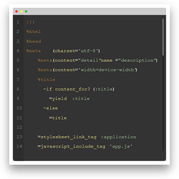

# Shadowit Examples

### Unaltered image

<p align="center"></p>
<p align="center">Sample image used, with no shadow</p>

----

### Default options
<p align="center"></p>

```bash
$ python shadowit.py sample.png -o output.png
```

----

### Darker shadow
<p align="center"></p>

```bash
$ python shadowit.py sample.png -o output.png --color black --opacity 70
```

----

### Offset shadow
<p align="center"></p>

```bash
$ python shadowit.py sample.png -o output.png --color black --opacity 70 -x -10
```

----

### Bordered image
<p align="center"></p>

```bash
$ python shadowit.py sample.png -o output.png --borderSize 7 --borderColor white
```

## Credits

Sample image is credited to Thoughtbot with their [Foundry project](http://thoughtbot.github.io/foundry/).