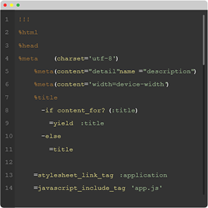
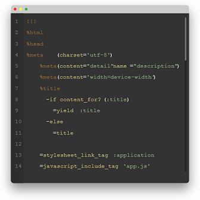
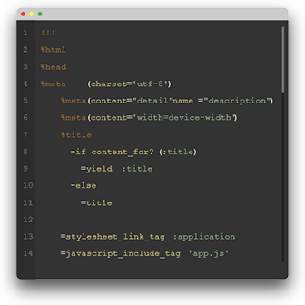
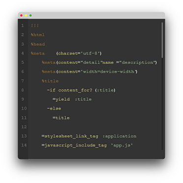
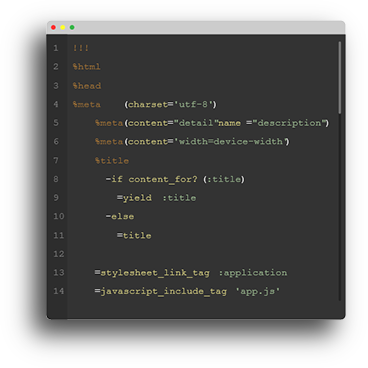

# Shadowit Examples

### Unaltered image

<p align="center"></p>
<p align="center">Sample image used, with no shadow</p>

----

### Default options
<p align="center"></p>

```bash
$ python shadowit.py sample.png
```

----

### Darker shadow
<p align="center"></p>

```bash
$ python shadowit.py sample.png --color black
```

----

### Small shadow
<p align="center"></p>

```bash
$ python shadowit.py sample.png --size 12 -y 12
```

----

### Offset shadow
<p align="center"></p>

```bash
$ python shadowit.py sample.png --size 12 -x -12 -y 14
```

----

### Shaped shadow
<p align="center"></p>

Given an image with a transparent background, Shadowit will apply a shaped shadow.

```bash
$ python shadowit.py sample.png
```

## Credits

Sample image is credited to Thoughtbot with their [Foundry project](http://thoughtbot.github.io/foundry/).
